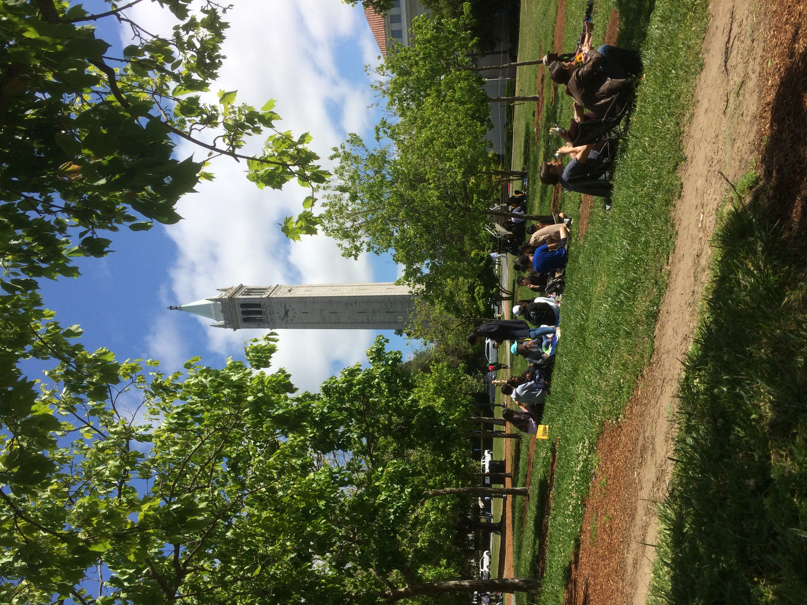

Hi there! This is officially my first blog post 🎉. 

I built the site with [Netlify](https://netlify.com) and changed a bit of styling.  

Oh, by the way, Netlify is also where I'm going to work this summer! I will join as a Data Science Interns. I will start tomorrow and really excited to join the team and do something! 

The excitement transformed into my motivation of learning. Therefore, I search and found some cool data science resources , such as:

  1. (Blog)[Airbnb Data Science Blog](https://medium.com/airbnb-engineering) - a lot of case study 

  2. (Course)[Kaggle Learning](https://www.kaggle.com/learn/overview) - with courses for basic DS skills.  
  
  3. (People)[Data Science Lessons from Young Tsai](https://medium.com/young-tsai/tagged/data) - Young was my mentor at Jun-Yi, he shares a lot of his thoughts in this blog. 

  4. (Article)[Advice for New Data Scientists](https://medium.com/airbnb-engineering/new-data-scientists-tips-for-success-5f898b6a33f3)

Those are inspring great content. Since I know I'm going to learn a lot of stuff like this in the future, I estabilihed [my Notion page](https://www.notion.so/yhhuang/f115100b075840f9bf971dcb70fd8f73?v=aac4c630813a465395235ef0d8a70201) to collect and process my Data Science readings. (Let's see how it goes!)

In fact, the best thing I found today is this podcast: "[Interview with Mathias, CEO of Netlify](https://softwareengineeringdaily.com/2019/03/08/netlify-with-mathias-biilmann-christensen/)" by SE Daily. It is a great content because the host asked so many deep questions. Here's some of them:

1. How would you describe Netlify? More fundementally, what is a "Static page"?

2. As front-end engineer, people often feels the need of learning everything. What's your thoughts on that?

3. Does being a CEO changed your view about business?

4. How do you decide area of focus, if the trend itself is complex and overwhamled?

5. What distinguish Netlify from other Platform-As-A-Service company(such as Firebase)? 

6. What makes you choose to become a tech CEO rather than musician? (The CEO earned a music degree in college!)

7. What has been the biggest challenge to Netlify?

Got really interesting answers:

- Working in Netlify is building tool for people, so people can create amazing things. For example, running the JAMstack hackathon enables beginners to build great projects with Netlify, and it's so rewarding to see that. 

- Netlify has 10,000,000 monthly unique user per month (wow!)

- Being a tech CEO v.s. a music composer: Something in two roles are surprisingly common, such as letting a group of people follow the same motion, building the vision for the team, make people believe in the same thing. The great path is not taking micro-management, but lead the poeple to do amazing work. 

- The process of testing -> learning -> iterating -> product market fit is _enjoyable_ !

- The trends that makes Netlify high potential: (1) Git & Version control become popular. (2) The evoluation of broswer: From document viewing to operating system that process JS code. (3) The rise of microservices, make the job more focus on connecting services together.   

- "Product is not a company.", the CEO has to understand how to 

Glad to find this podcast and finish it today! A great inspiration and learning. Actually, there're so many terms that I don't know the theory behind. Hopefully, all this curiosity will be learning motivation, and I'm looking forward to upcoming learning journey! 

p.s. Spent quite chill time and UC Berkeley today. 

