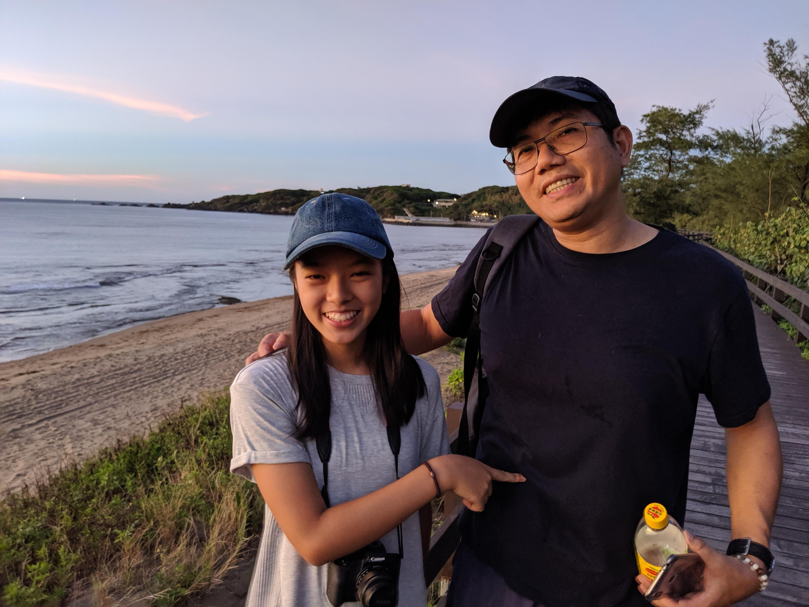
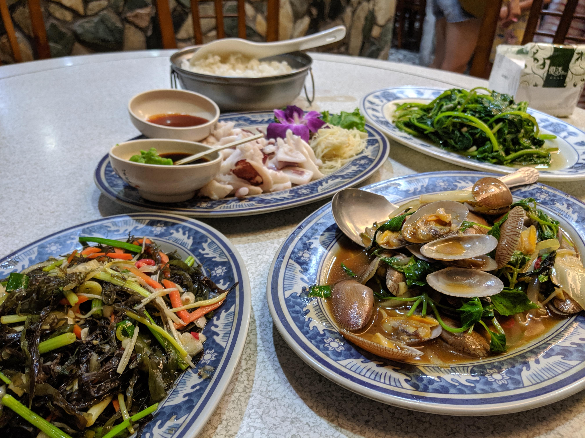
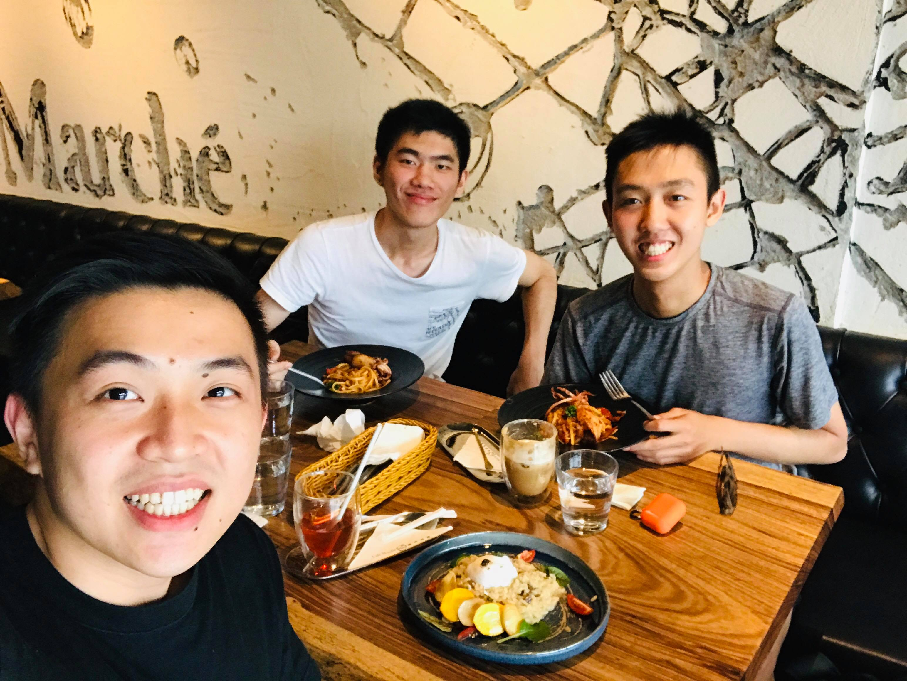
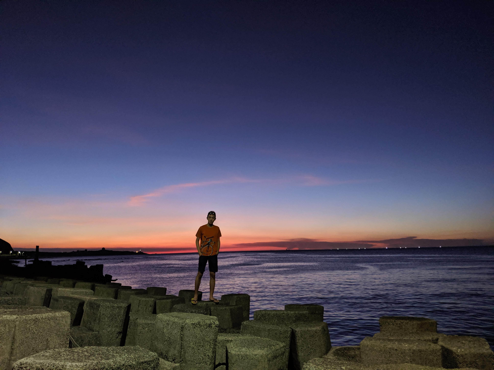
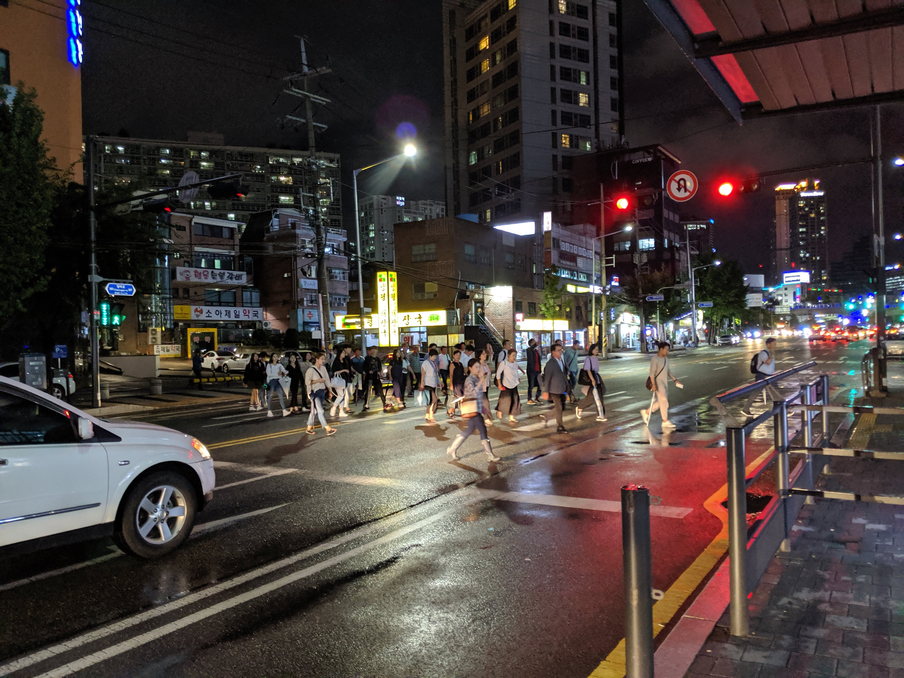

This blog is a new update from Seoul, since I left San Francisco. 

I had a really great time during Netlify internship. Since then, I have travel around. 

- **Hacklodge @ Menlo Park, US** (Late Aug): An immersive software development program for students. Within a week, I met talented individuals as well as new friends. I also build "[Collager.party](https://collager.party)", a online tool for creative collage.

- **Home Trip @ Taipei, Taiwan** (Late Aug): I came home after 8 months of school and work! It was quite relaxing and happy to spend most of time with family, friend and food. 

- **New Semester kick off @ Seoul, South Korea** (Early Sep): A new semester started with lots of hugs and familiar face! In the following four month, I'll try my best to explore my own understanding to the city, refine values I truely care about, and spend more time on friendship. 

Alright, here's about it! I want to keep it short, let's end with some random but meanful pictures. 💁🏻‍♂️

This blog will irregularyly update with lots of grammar errors. Thank you for reading, anyway!

*Peace,* 
Yueh Han 