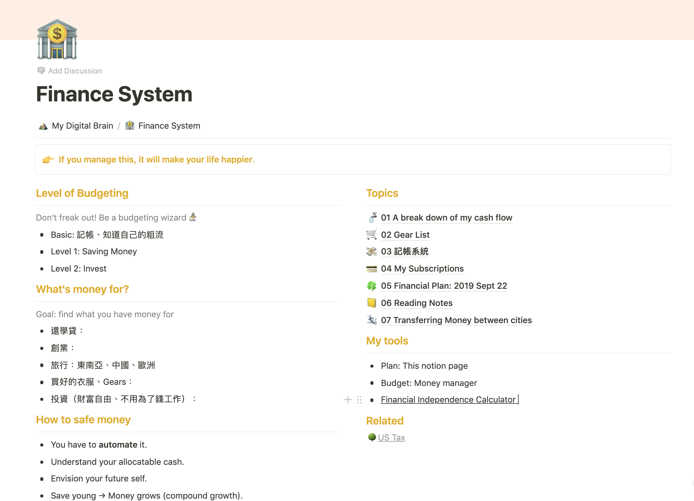

## Financial Blindness 😢

For a while, I avoid thinking about my financial planning rationally, because I gave myself these excuses: 

-   Spending money on quality things worth it, so I don't need to consider to much. 

-   Have a realistic understanding to my financial goal is painful. So I avoid looking at it. 
    
-   I could have done this earlier, I feel like I'm late thinking about it. (i.e. #FOMO)

-   I feel like spending time on these things are boring. 

-   The financial education resources are misleading. Lots of people write them for their own interest, such as plug in or showing status.  

-   At the same time, I feel like I'm not 'smart' or 'knowledgeable' to take action. 

-   My spending hobit are big enermy to great plan. Forming a new habit it tiring. 

-   Strange fact: I'm not really incentivized by short-cut that saves money.  
 
_(Off topic: It will be interesting to dig deeper on how these "heuristics" are formed.)_

---

## The breakthrough 💎

Until recently, I feel like I made some progress on my financial planning. It starts with real pressure on "I need to solve to problem and have cash to use in Seoul". 

Later, I read some articles, and the famous book "The 4-Hour Workweek" (on blinist), which help me more educated on the ultimate goal of financial planning: **Buy things you would appreciate to have**, and **Own more free time**. On my awakening process, I also come up with some ✨heuristics✨, such as:

1. Building up a personal financial system take initial hustle, but can keep operating with less maintenance efforts (i.e. it's fly-wheel like thing)

2. The earlier you work on it, the better it returns (compound interest). 

3. If you're able manage this, it will make your life happier. 

(These facts are really positive, isn't it?)

Finally, the last thing that kick things off is a podcast episode on budgeting as a college students. For students in financial disadvantage, they work harder to figure out how to cut down expenses and gain income, and that hustle touched me. 

So pressure + reading + mindset + an episode was by equation to financial planning. I spent around 2 hours to conduct thoughts into this Notion document:

Yueh Han 